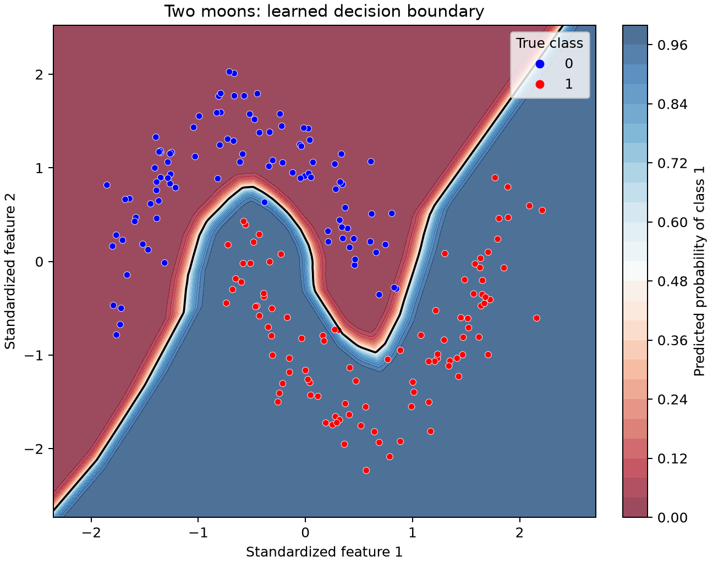
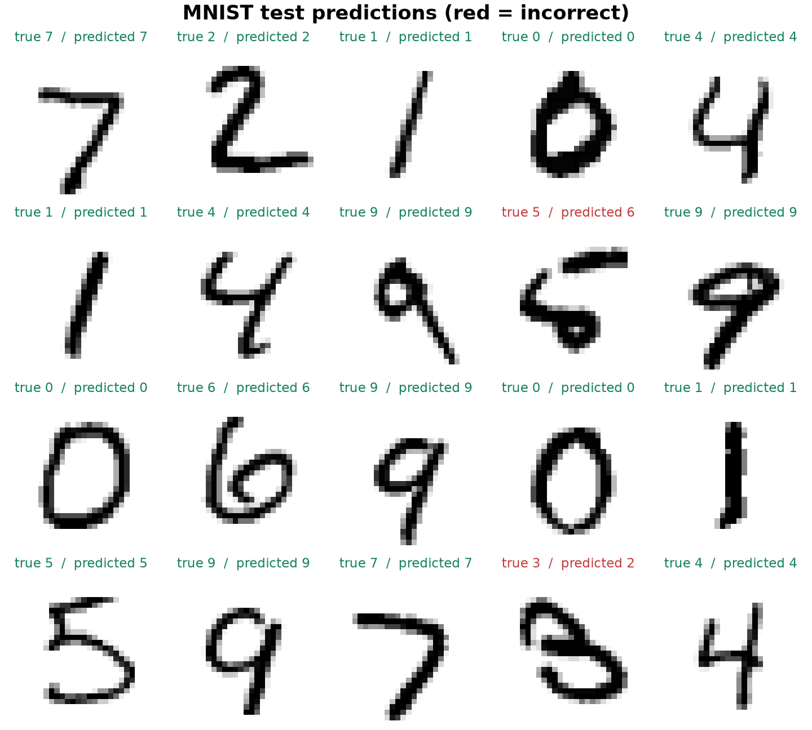

# NumPy Neural Network


<i>(The model actually figured out the non-linear pattern here. It curves cleanly between the two shapes and gets almost every point in the right zone, no overfitting, and it's not just cutting a straight line through the middle like a lazier model would)</i>

## What this is

The `NeuralNetwork` class wires up a fully connected stack of layers from an architecture list like `[784, 128, 64, 10]`. Hidden layers use ReLU. The output layer uses softmax with cross-entropy loss. Weights are initialized with He (Kaiming) scaling so early activations stay in a sensible range.

Forward pass, backward pass, and parameter updates are all written out explicitly:

- Forward: `Z = W @ A + b`, then ReLU or softmax
- Loss: cross-entropy against one-hot labels
- Backward: layer-by-layer gradients via the chain rule
- Update: plain batch gradient descent

## Setup

```bash
pip install -r requirements.txt
```

You only need NumPy.

## Run the demos

```bash
python train.py
```

The script runs two checks:

1. **Two moons**: a synthetic binary dataset with interleaved crescents. It is not linearly separable, so it is a clean check that the network can learn a curved decision boundary.

2. **MNIST**: handwritten digits downloaded on first run into a local `data/` folder. Training uses a subset by default so it finishes in a reasonable time on a laptop.

During training you will see loss and accuracy printed at regular intervals. Both should improve as epochs go on.

## Results


[Click here to see more visualizations](./assets/)

These numbers come from a full run of `python train.py` on a typical laptop setup (Windows, Python 3, NumPy only). Random seeds are fixed (`42`) so you should get very similar figures if you run it yourself. The whole script (both demos back to back) finishes in roughly half a minute once MNIST is already downloaded.

The point of documenting this is not to boast about benchmark scores. It is to show what *actually happens* when you train a from-scratch network with plain gradient descent: loss goes down, accuracy goes up, and the gap between train and test tells you something honest about generalization.

### Demo 1: Two moons

**The problem.** Two interleaved crescent-shaped clusters in 2D. A straight line cannot separate them. If the network only memorized coordinates instead of learning shape, you would see high train accuracy and poor test accuracy. That did not happen here.

**Setup.**

| Setting | Value |
|---------|-------|
| Samples | 1,000 (500 per class) |
| Noise | Gaussian, σ = 0.15 |
| Train / test split | 80% / 20% (800 train, 200 test) |
| Preprocessing | Feature standardization (zero mean, unit variance) |
| Architecture | `[2, 32, 16, 2]` |
| Epochs | 1,500 |
| Learning rate | 0.2 |
| Optimizer | Full-batch gradient descent |

**Training curve.**

| Epoch | Loss | Accuracy |
|-------|------|----------|
| 1 | 0.973 | 43.88% |
| 300 | 0.031 | 99.25% |
| 600 | 0.018 | 99.25% |
| 900 | 0.015 | 99.38% |
| 1200 | 0.013 | 99.38% |
| 1500 | 0.012 | 99.38% |

**What to make of it.** The first epoch is essentially guessing, cross-entropy around 0.97 and accuracy below 50%. By epoch 300 the network has already found a curved decision boundary: loss drops by more than thirty-fold and accuracy jumps into the high nineties. After that, improvements are incremental. Loss keeps edging down (0.031 → 0.012) while accuracy plateaus around 99.4%. That late-stage behaviour is normal: the model is fine-tuning weights around an already-good boundary rather than discovering something new.

**Final scores.**

| Split | Accuracy |
|-------|----------|
| Train | 99.38% |
| Test | **99.50%** |

Test accuracy slightly *beats* train accuracy here. With only 200 test points that can happen by chance, but it is a reassuring sign: the network is not overfitting the moons dataset. For a toy problem with 1,000 noisy points and no regularization, that is a solid outcome. It confirms the implementation: forward pass, softmax + cross-entropy backward pass, and ReLU gradients are all wired correctly.

### Demo 2: MNIST digits

**The problem.** Classify 28×28 grayscale handwritten digits (0–9). This is the classic step up from synthetic 2D data: 784 input features, 10 output classes, real-world pixel variation.

**Setup.**

| Setting | Value |
|---------|-------|
| Training samples | 5,000 (subset of full 60,000) |
| Test samples | 1,000 (subset of full 10,000) |
| Preprocessing | Pixel values scaled to [0, 1], then standardized |
| Architecture | `[784, 128, 64, 10]` |
| Epochs | 30 |
| Learning rate | 0.5 |
| Optimizer | Full-batch gradient descent |

The subset is intentional. Full MNIST on batch gradient descent with no mini-batching would be slow on a laptop. Five thousand training images is enough to see whether the network learns digit structure without waiting minutes per epoch.

**Training curve.**

| Epoch | Loss | Accuracy |
|-------|------|----------|
| 1 | 2.957 | 8.54% |
| 5 | 0.620 | 82.64% |
| 10 | 0.344 | 90.28% |
| 15 | 0.249 | 92.92% |
| 20 | 0.191 | 94.86% |
| 25 | 0.154 | 96.16% |
| 30 | 0.129 | 96.90% |

**What to make of it.** Epoch 1 is barely above random (10 classes → ~10% expected). By epoch 5 the network has already learned stroke patterns and loops, accuracy above 80%. The steepest gains come early; epochs 20–30 still help but each step adds less. Training loss ends at 0.129 with 96.90% training accuracy.

**Held-out test score.**

| Metric | Value |
|--------|-------|
| Test accuracy (1,000 images) | **88.60%** |

There is a gap between train (~97%) and test (~89%). That is expected here for several reasons working together:

- **No mini-batches or shuffling**: the same 5,000 images in the same order every epoch. Batch GD on a fixed ordering can converge to a solution that fits the training set a little too comfortably.
- **No regularization**: no dropout, weight decay, or early stopping.
- **A relatively high learning rate (0.5)**: helps speed on a small subset but can overshoot fine details that generalize.
- **Only 30 epochs on a subset**: enough to learn, not enough to squeeze out every generalization trick.

88.6% on 1,000 test digits with ~15k parameters and zero framework magic is respectable for educational code. State-of-the-art CNNs hit 99%+, but they use convolutions, data augmentation, and better optimizers. This result shows the core idea works: matrix multiplies and ReLU layers can read handwriting.

### Summary

| Demo | Task | Test accuracy | Takeaway |
|------|------|---------------|----------|
| Two moons | Binary, non-linear 2D | 99.50% | Non-linear boundaries learned; no obvious overfitting |
| MNIST | 10-class digits | 88.60% | Real images classified well; train/test gap shows room for SGD, regularization, or more data |

Both runs used the same `NeuralNetwork` class with no code changes between demos: only architecture list, learning rate, and epoch count differ. That is the whole pitch of the project: one small implementation, two very different problems, both solved by the same forward/backward/update loop.

If your numbers drift slightly, check that `np.random.seed(42)` is set in `train.py` and that you have a recent NumPy install. Large differences usually mean a changed hyperparameter or a partial/interrupted MNIST download.

## Using the class yourself

```python
from neural_network import NeuralNetwork

model = NeuralNetwork([input_dim, hidden_dim, num_classes])
history = model.fit(X_train, y_train, epochs=500, learning_rate=0.1)
predictions = model.predict(X_test)
probabilities = model.predict_proba(X_test)
```

`X` can be shaped as `(num_samples, num_features)` or `(num_features, num_samples)` (the class normalizes internally). Labels should be integer class indices.

## How the math fits together

For a batch of `m` samples stored as columns:

| Step | Formula |
|------|---------|
| Linear layer | `Z^[l] = W^[l] A^[l-1] + b^[l]` |
| ReLU | `A^[l] = max(0, Z^[l])` |
| Softmax | `A^[L] = exp(Z^[L] - max) / sum(exp(...))` |
| Loss | `L = -1/m sum(y log A^[L])` |
| Output gradient | `dZ^[L] = A^[L] - Y` |
| Hidden gradient | `dZ^[l] = (W^[l+1]^T dZ^[l+1]) ⊙ ReLU'(Z^[l])` |
| Weight gradient | `dW^[l] = 1/m dZ^[l] (A^[l-1])^T` |
| Bias gradient | `db^[l] = 1/m sum(dZ^[l])` |

Softmax subtracts the per-column maximum before exponentiating to avoid overflow. Cross-entropy clips probabilities slightly so `log(0)` never appears.

The output-layer gradient simplifies to `A - Y` when softmax and cross-entropy are paired. That is the usual trick and it is what the backward pass implements.

## Project layout

```
numpy-neural-network/
├── neural_network.py
├── train.py
├── visualize.py
├── requirements.txt
└── README.md
```

## Notes

There is no mini-batch shuffling, momentum, Adam, dropout, or regularization. Those are straightforward to add once the core loops make sense. The goal here is to show that a working classifier really is just repeated matrix multiply, a nonlinearity, and careful calculus on the way back.
